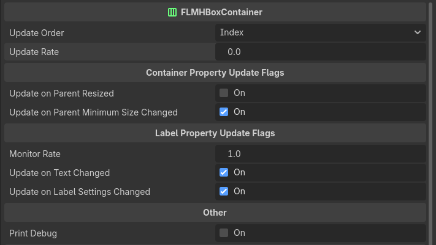
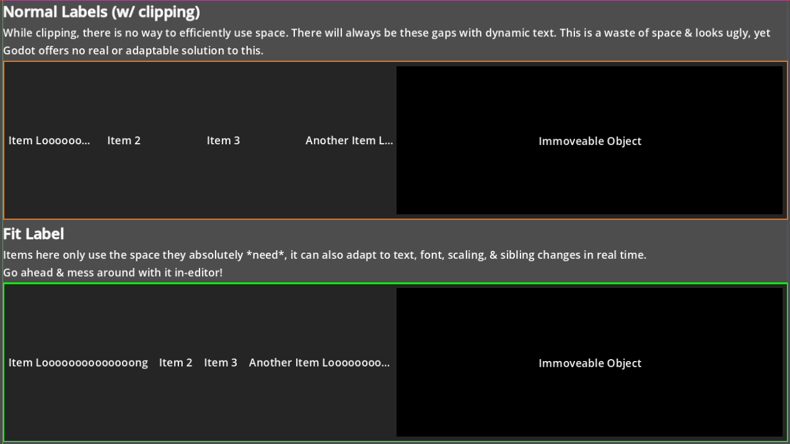

</img>

A couple of custom Control nodes for efficiently positioning & sizing clipped labels. Built for Godot 4.5 / 4.6.

 **Version:** 1.0.0

# How to install
This is NOT a plugin, all you need to do is copy the items in the `FitLabel Nodes` folder into your project & they will immediately be usable.

# How to use
There are two ways to use the `FitLabel` node.
1. You can maually call it's `update` method to adapt it's size, however efficient, it is tedious & you may not be able to cover all cases in which it may need to be updated.
2. Utilize the `FLMHBoxContainer` node to store & manage all the `FitLabel` children for you.

## How to use the FLMHBoxContainer node
The FLMHBC (FitLabel Manager Horizontal Box Container) node (I know, it's a mouthful) is just like like a regular HBoxContainer, except it can be used to automatically update `FitLabel` children based on it's parameters.
</img>

You can either have it update based on specific signals, or have it update at a set interval, whatever works best for your scenario is what you should go with.

# Example Scene
This repo includes an example scene you can use to mess around with the mechanics.
</img>
